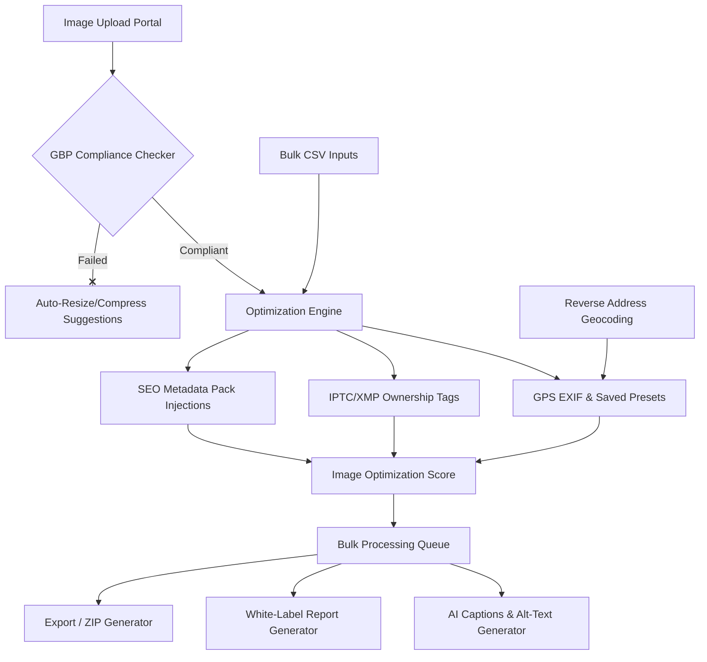

# Product Requirement Document (PRD 2.0)
## Buzz GeoTagger: The Ultimate Local SEO Image Optimizer & Geolocator Suite

---

## 1. Executive Summary & Vision
**Buzz GeoTagger 2.0** transforms from a standalone geo-tagging utility into an **Enterprise-Grade Local SEO Image Optimization & Content Suite**. Designed specifically for local SEO agencies, franchise brands, multi-location clinics, restaurants, and real estate developers, this platform automates the tedious processes of location compliance, copyright ownership injection, EXIF/IPTC/XMP optimization, and white-label client reporting.

By leveraging 100% open-source free mapping services (Leaflet + Nominatim) alongside professional metadata extraction standards, Buzz GeoTagger 2.0 bridges the gap between raw photography and highly structured, Google-Business-Profile-compliant local content assets.

---

## 2. Core System Architecture (2.0)



---

## 3. High-Fidelity Feature Specifications

### Feature 1: GBP Photo Compliance Checker
This feature acts as the gateway diagnostic tool, ensuring every uploaded photo adheres perfectly to official Google Business Profile guidelines before optimization occurs.

*   **Official Google Guidelines Checked:**
    *   **Format:** Must be JPG or PNG.
    *   **File Size:** Must be between 10 KB and 5 MB.
    *   **Recommended Resolution:** 720 × 720 pixels (Optimal).
    *   **Minimum Resolution:** 250 × 250 pixels.
    *   **Quality Metrics:** Detects blurred elements, dark lighting, or duplicate metadata structures.
*   **UX Action Plan:** If an image fails, offer an automated, one-click **"Auto-Resize & Compress"** option that adjusts it to optimal boundaries without losing visual quality.
*   **Sample Output:**
    ```json
    {
      "status": "Ready for Google Business Profile",
      "format": "JPG",
      "size": "1.4 MB",
      "resolution": "1080 x 1350",
      "geoTag": "Added (25.2532, 55.3034)",
      "seoFilename": "dental-clinic-dubai-01.jpg"
    }
    ```

---

### Feature 2: Professional Metadata Report Generator
Agencies require proof of work to present to high-ticket local SEO clients. This feature generates a downloadable, print-ready white-labeled PDF/HTML document showing a comprehensive recap of optimized metadata.

*   **Report Contents:**
    *   **Header:** Custom agency name, logo, date of generation, and target client profile.
    *   **Performance Metrics:** Total uploaded, tagged, and failed items.
    *   **Interactive Maps Preview:** Rendered static OpenStreetMap showing exact marker pins where optimized EXIF data was embedded.
    *   **Metadata Details Table:**
        | Image Name | Selected Coordinates | Injected Address | Original Metadata | Optimizations Made |
        | :--- | :--- | :--- | :--- | :--- |
        | dental-01.jpg | `25.2532, 55.3034` | BurJuman, Dubai | None | GPS + IPTC Copyright + Alt Text |

---

### Feature 3: Before/After Visual Metadata Viewer
Replaces dry technical headers with an elegant, side-by-side comparative dashboard that allows users to instantly preview the structural changes made to their image files.

*   **Sleek Comparison Interface:**
    ```
    +--------------------------------------+--------------------------------------+
    |             BEFORE METADATA          |            AFTER METADATA            |
    +--------------------------------------+--------------------------------------+
    | GPS:        Not Found                | GPS:        Added (EXIF Tagged)      |
    | Latitude:   --                       | Latitude:   25.2532                  |
    | Longitude:  --                       | Longitude:  55.3034                  |
    | Title:      Empty                    | Title:      Best Dental Clinic Dubai |
    | Keywords:   Empty                    | Keywords:   dentist dubai, dental    |
    | Copyright:  Empty                    | Copyright:  Dr Joy Dental Clinic     |
    | Filename:   DSC092381.JPG            | Filename:   dental-clinic-dubai.jpg  |
    +--------------------------------------+--------------------------------------+
    ```

---

### Feature 4 & 5: SEO Metadata & IPTC/XMP Copyright Pack
Extends basic GPS taggers by writing deep metadata structures recommended by official Google Images and IPTC standards for image indexation and search snippet context.

*   **Injected Metadata Schema:**
    *   **Core EXIF/SEO Pack:**
        *   `Image Title`: Custom search descriptive title (e.g. *Best Dental Clinic in Dubai*)
        *   `Image Description`: Multi-keyword caption describing the specific location context.
        *   `Keywords / Tags`: Comma-separated focus keywords targeting search volumes.
        *   `Subject/Business Name`: Targeted franchise name.
        *   `City, Country`: Target local market.
    *   **IPTC / XMP Ownership Pack:**
        *   `Creator / Photographer`: Creator's Agency name (e.g. *Buzz Entertainment Media*)
        *   `Copyright Notice`: Client Business Ownership.
        *   `Credit Line`: Reference attribution.
        *   `Source`: Web portal origin.
        *   `Web Statement URL (Licensor URL)`: URL directing to agency license or client domain (prevents visual piracy).

---

### Feature 6: Location Presets & Saved Favorites
Franchise managers and SEO agencies work with the same client branches repeatedly. This feature stores frequently targeted coordinates as quick-select templates to avoid manual search entries.

*   **Saved Preset Types:**
    *   **Client-wise Location Groups:** (e.g. Group *Dr Joy Dental Clinic* contains *BurJuman*, *Jumeirah*, *DIFC* branches).
    *   **Favorite Coordinates:** Single-click star icons.
    *   **Recent Locations:** Auto-saved history logs of the last 10 geolocations used in the workspace.

---

### Feature 7: Enterprise CSV Bulk Geo-Tagging
A power-user feature built for massive optimizations, allowing agencies to process thousands of field operations via structured spreadsheets in one cycle.

*   **CSV Layout Standard:**
    ```csv
    filename,latitude,longitude,city,business_name,keywords
    jumeirah-01.jpg,25.2048,55.2708,Dubai,Dr Joy Dental Clinic,dentist jumeirah
    burjuman-02.jpg,25.2532,55.3034,Dubai,Dr Joy Dental Clinic,dental care burjuman
    ```
*   **Automation Heuristics:** The system processes the queue asynchronously, matches files by name, embeds exact parameters, and generates a structured download output.

---

### Feature 8: Reverse Address Geocoding
Using CartoDB and OpenStreetMap's Nominatim, if a user drags a map pin or inputs a numeric lat/lng coordinate, the tool dynamically detects and displays the readable address instantly without requiring external geocoders.
*   **Example Input:** `25.2532, 55.3034`
*   **Dynamic Reverse Output:** *BurJuman, Bur Dubai, Dubai, United Arab Emirates*

---

### Feature 9: SEO Image Rename Templates
Eliminates camera-default file names (like `IMG_9381.jpg`) and replaces them with descriptive search structures.

*   **Pre-Built Category Presets:**
    *   **Medical/Clinic:** `{businessName}-{service}-{branch}-{number}`
    *   **Restaurant:** `{businessName}-{dishName}-{city}-{number}`
    *   **Real Estate:** `{developerName}-{project}-{area}-{number}`
    *   **Generic Local Business:** `{businessName}-{keyword}-{city}-{number}`
*   **Example Output:** `dr-joy-dental-clinic-dubai-01.jpg`

---

### Feature 10: AI Caption & Alt-Text Generator
Transforms the tool from a standard tagger into a comprehensive **Local SEO content marketing engine**.
*   **Outputs Generated:**
    *   **Instagram Caption:** Ready-to-copy social post targeting regional location tags.
    *   **GBP Post Caption:** Prompts call-to-actions, telephone, and branch links.
    *   **Alt Text:** Screen-reader-compliant local keyword-optimized descriptions.
    *   **SEO Title / Local Hashtags:** Curated list of high-converting local tags.

---

### Feature 11 & 12: Client Project Dashboard & White Label Reporting
Reorganizes basic lists into segmented workspaces where agency users can categorize their workloads by clients, folders, and multi-location directories.
*   **Client Project Layout:**
    *   **Folders:** Organized client-wise.
    *   **Branch Preset Management:** Quick toggles for regional branches.
    *   **Stats recap:** Total processed count, pending uploads, and download logs.
*   **White Label Customizations:** Subscribed Agency Tier users can upload their own logo, remove "Buzz GeoTagger" references from metadata, and brand export reports with custom footers.

---

### Feature 13: Optional Metadata Watermark Overlay
*   **GBP Safety Rule:** excessive graphical filters or heavy overlays violate GBP guidelines. So, watermarking is strictly **optional and off by default**.
*   **Watermark Types:**
    *   Subtle bottom-right text coordinates (e.g. *Dr Joy Clinic - 25.2532° N, 55.3034° E*).
    *   Timestamp watermark.
    *   Agency branding credits watermark.

---

### Feature 14 & 15: "Audit Only" Mode & Image Optimization Score
An extremely powerful pre-sales feature. Agencies can audit client images, show their poor "SEO Scores," and present the tool as the direct solution to upgrade their ranking metrics.

*   **Image Optimization Score Calculator:**
    ```
    Score = (has_gps * 25) 
          + (seo_filename * 15) 
          + (compliant_size_res * 15) 
          + (has_seo_metadata_pack * 20) 
          + (has_iptc_copyright * 15) 
          + (has_city_country * 10)
    ```
*   **UX Gamification:** Display an interactive, color-coded score gauge (Red: 0-49, Yellow: 50-79, Green: 80-100) motivating agencies and business owners to optimize their portfolios up to 100/100.

---

## 4. Professional Version Roadmap

```
+-------------------------------------------------------------------------------+
|                        BUZZ GEOTAGGER ROADMAP PRESETS                         |
+-------------------------------------------------------------------------------+
|  VERSION 1.0 (MVP)            |  VERSION 1.1 (Quality Upgrade)               |
|  * Image Upload / Maps select |  * GBP Photo Compliance Checker               |
|  * EXIF GPS Write & Verify    |  * Before/After Comparative Metadata Viewer   |
|  * ZIP generation & Download  |  * SEO Metadata Pack & Saved Preset Locations |
|  * Basic User Profiles & Auth |  * Metadata PDF/HTML Report Generator         |
+-------------------------------------------------------------------------------+
|  VERSION 1.2 (Agency Tier)    |  VERSION 2.0 (AI Local SEO Suite)            |
|  * Multi-Branch Client Folders|  * AI Local Alt-Text & Instagram Captions     |
|  * White Label Custom Reports |  * Reverse Geocoding Address Auto-Detection   |
|  * Metadata Auditing Engine   |  * Bulk CSV Batch Tagging Pipeline            |
|  * Image Optimization Score   |  * Automated Resizer & Compression suggestions |
+-------------------------------------------------------------------------------+
|  VERSION 3.0 (Full SaaS)      |
|  * Enterprise Team Roles      |
|  * Background Bulk Queues     |
|  * Dynamic Stripe Billing     |
|  * REST API Integration       |
+-------------------------------+
```

---

## 5. Technical Frameworks & Compliance

1.  **Leaflet & OpenStreetMap Integrations:** 100% free open-source geolocators. Utilizes Leaflet maps alongside Nominatim Geocoder lookup hooks for bounds processing and manual search lookups without requiring expensive Mapbox tokens.
2.  **EXIF & IPTC Parsing Engine:** Relies on robust client-side `exifreader` or equivalent libraries to inspect, parse, and display pre-existing image tags in under 150ms.
3.  **PostgreSQL Audit & Metric Logs:** Tracks statistics at `/api/admin/stats` to deliver dynamic MRR and ARR indicators based on local agency subscription tiers.
4.  **UX / Rich Glassmorphic styling:** Dark mode panels, subtle gradients, clean hover states, neon green compliance badges, and responsive tables optimized for both mobile and high-resolution monitors.
